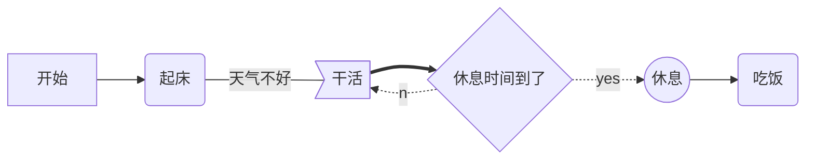
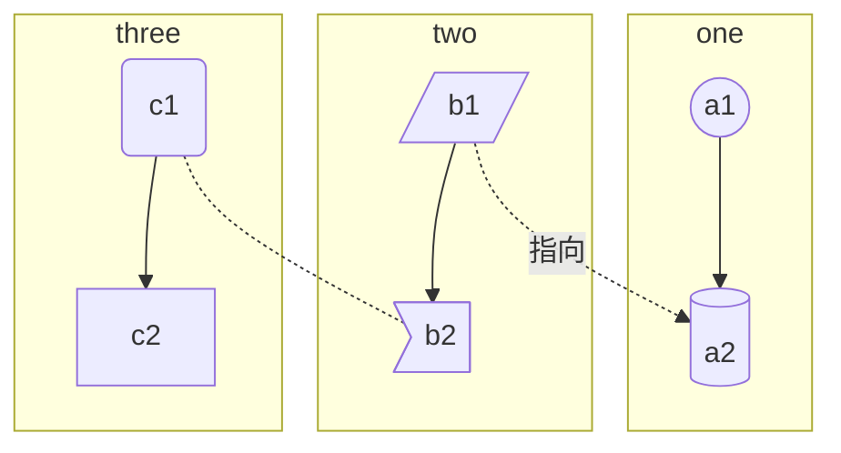
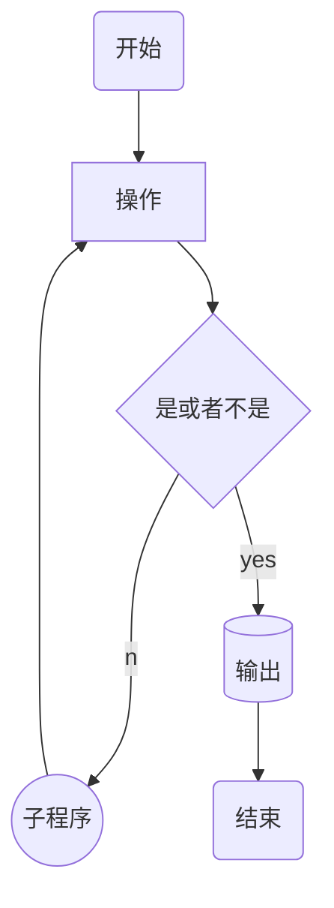

# markdown 流程图

- markdown 图标支持类型:
  - 流程图:mermaid(样式流程图),flow(标准流程图)
  - 时序图:mermaid(样式时序图),sequence(标准时序图)
  - 甘特图:mermaid

---

## 一,流程图

### 1.1 标准流程图(flow)

```flow
    start=>start: 接收到信息
    info=>operation: 读取信息
    setCache=>operation: 更新缓存
    end=>end: 处理结束
    start->info->setCache->end
```

---

```flow
    st=>start: start
    op=>operation: your operation
    cond=>condition: yes /no?
    e=>end
    st->op->cond
    cond(yes)->e
    cond(no)->op
```

---

**关键字**

```
start流程开始,圆角矩形
operation操作,直角矩形
condition操作,菱形
subroutine子流程,左右带白空旷的矩形
inputoutput输入输出,平行四边形
end流程结束,圆角矩形
```

```flow
    start=>start: API请求
    cache=>operation: 读取Redis缓存
    cached=>condition: 是否有缓存?
    sendMq=>operation: 发送MQ,后台服务更新缓存
    info=>operation: 读取信息
    setCache=>operation: 保存信息
    end=>end: 返回信息

    start->cache->cached
    cached(yes)->sendMq
    cached(no)->info
    info->setCache
    setCache->end
    sendMq->end
```

```flow
    st=>start: 开始
    ipt=>inputoutput: 输入一个x
    op=>operation: 处理加工x+1
    cond=>condition: 溢出(yes/no)
    sub=>subroutine: 子流程
    io=>inputoutput: 输出x
    ed=>end: 结束

    st->ipt->op->cond
    cond(yes)->io->ed
    cond(no)->sub->io->ed
```

- 复杂的三流程
  ```flow
    st=>start: Start|past:>http://www.google.com[blank]
    e=>end: End:>http://www.google.com
    op1=>operation: get_hotel_ids|past
    op2=>operation: get_proxy|current
    sub1=>subroutine: get_proxy|current
    op3=>operation: save_comment|current
    op4=>operation: set_sentiment|current
    op5=>operation: set_record|current
    cond1=>condition: ids_remain空?
    cond2=>condition: proxy_list空?
    cond3=>condition: ids_got空?
    cond4=>condition: 爬取成功??
    cond5=>condition: ids_remain空?
    io1=>inputoutput: ids-remain
    io2=>inputoutput: proxy_list
    io3=>inputoutput: ids-got
    st->op1(right)->io1->cond1
    cond1(yes)->sub1->io2->cond2
    cond2(no)->op3
    cond2(yes)->sub1
    cond1(no)->op3->cond4
    cond4(yes)->io3->cond3
    cond4(no)->io1
    cond3(no)->op4
    cond3(yes, right)->cond5
    cond5(yes)->op5
    cond5(no)->cond3
    op5->e
  ```

---

### 1.2 样式流程图

**graph 指定流程图方向：**

- TB（ top bottom）表示从上到下
- BT（bottom top）表示从下到上
- RL（right left）表示从右到左
- LR（left right）表示从左到右

**元素的形状定义：**

- id[描述] 以直角矩形绘制
- id(描述) 以圆角矩形绘制
- id{描述} 以菱形绘制
- id>描述] 以不对称矩形绘制
- id((描述)) 以圆形绘制
- id[(描述)] 数据库类型
- id[[描述]] 子程序类型
- id{{描述}} 六边形
- id[/描述/] 平行四边形
- id[\描述/] 梯形

**线条定义：**

- A-->B 带箭头指向
- A---B 不带箭头连接
- A-.-B 虚线连接
- A-.->B 虚线指向
- A==>B 加粗箭头指向
- A--描述---B 不带箭头指向并在线段中间添加描述
- A--描述-->B 带描述的箭头指向
- A-.描述.->B 带描述的虚线连指向
- A==描述==>B 带描述的加粗箭头指向



---

**子程序**

```
subgraph title
  graph direction
end
```



